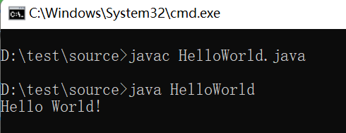

# 100%需要掌握的JAVA面试题
## 1、如何编写和运行JAVA运行程序？
1. 第一步：编写。写一个后缀名为.java的源文件，内容如下：
`public class HelloWorld {
    public static void main(String[] args) {
        System.out.println("Hello World!");
    }
}`

2. 第二步：编译。在DOS命令行中，进入Java源文件的目录，使用javac 命令进行编译。
`D:\test\source>javac HelloWorld.java`
编译完成后会生成一个后缀名为.class的字节码文件：

3. 运行：在DOS命令行中，进入Java源文件的目录，使用java 命令进行运行。
`D:\test\source>java HelloWorld`
4. 示例：
